<div align="center">

# 🎙️ Alexa Sentiment Analysis Dashboard

[](https://www.python.org/)
[](https://flask.palletsprojects.com/)
[](https://scikit-learn.org/)
[](https://opensource.org/licenses/MIT)

An industry-level Machine Learning, NLP, and Flask-based analytics dashboard that processes Amazon Alexa product reviews to accurately predict Positive, Neutral, and Negative sentiments.

</div>

---

## 📖 Project Overview

The **Alexa Sentiment Analysis Dashboard** is a comprehensive end-to-end data science and web application project. It utilizes Natural Language Processing (NLP) and Machine Learning techniques to extract deep insights from Amazon Alexa customer reviews. By categorizing feedback into **Positive**, **Neutral**, and **Negative** sentiments using TF-IDF Vectorization and Logistic Regression, the project provides a rich interactive dashboard for sentiment monitoring, trend tracking, and theme extraction.

## ✨ Key Features

* **Real-time Sentiment Prediction**: Input custom reviews to instantly classify sentiment as Positive, Neutral, or Negative.
* **Interactive Data Visualization**: Dynamic, responsive charts built with Plotly, Matplotlib, and Seaborn.
* **Modern Web Interface**: A clean, professional UI crafted with HTML, CSS, and Bootstrap.
* **NLP & Clustering**: Employs KMeans to group similar reviews and WordClouds to highlight prominent topics.

## 📊 Dashboard Features

The analytical dashboard provides a holistic view of user feedback through the following visual features:

| Feature | Description |
| :--- | :--- |
| **KPI Cards** | Quick glance summary metrics including Total Reviews, Average Rating, and Overall Sentiment Score. |
| **Sentiment Distribution Pie Chart** | Visualizes the proportional split of Positive, Neutral, and Negative reviews. |
| **Sentiment Trend Over Time** | Tracks the fluctuation of user sentiment across different timelines or product versions. |
| **Rating Distribution Histogram** | Displays the frequency of specific star ratings given by users. |
| **Rating vs Review Length Scatter Plot** | Examines the correlation between the length of a customer's review and their corresponding rating. |
| **KMeans Clustering** | Unsupervised learning to identify and group common themes or issues within the reviews. |
| **Positive Word Cloud** | Highlights the most frequent words used by highly satisfied customers. |
| **Neutral Word Cloud** | Displays recurring terms found in mixed or average feedback. |
| **Negative Word Cloud** | Highlights the most common complaints or issues raised by dissatisfied users. |
| **Confusion Matrix** | Evaluates and visualizes the accuracy and error types of the Logistic Regression model. |
| **Correlation Matrix** | Shows the statistical relationships between numerical dataset features. |

## 📸 Dashboard Screenshots

*Note: Dashboard visuals are stored in the `screenshots/` directory.*

### Main Dashboard

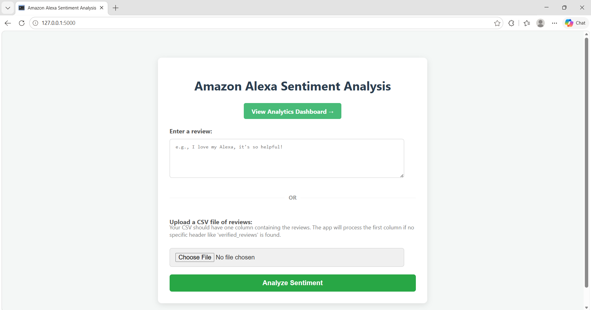
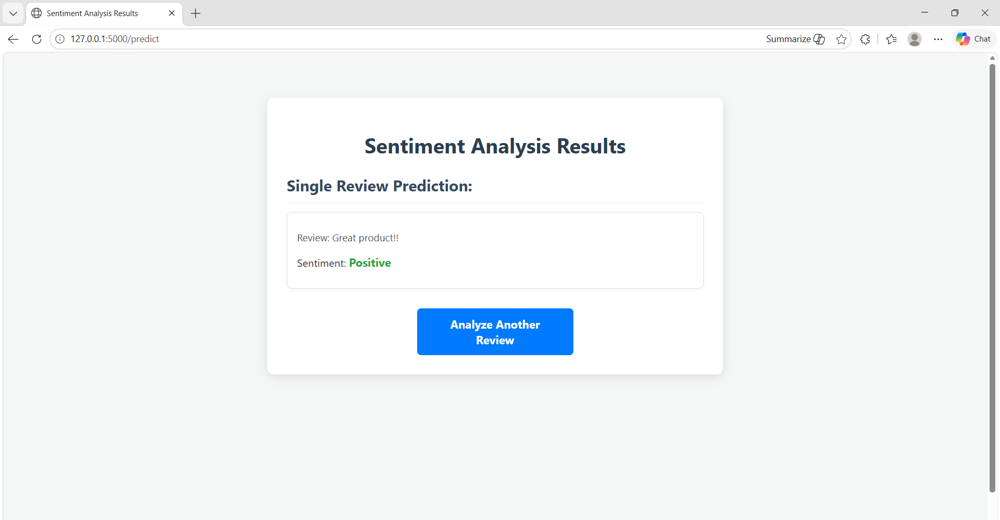
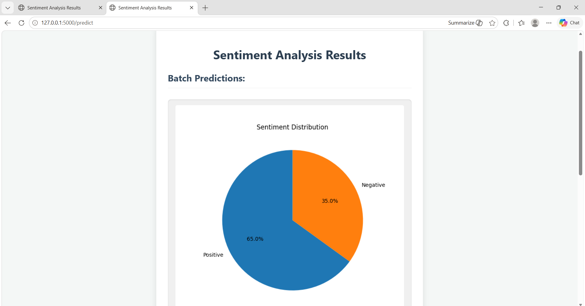
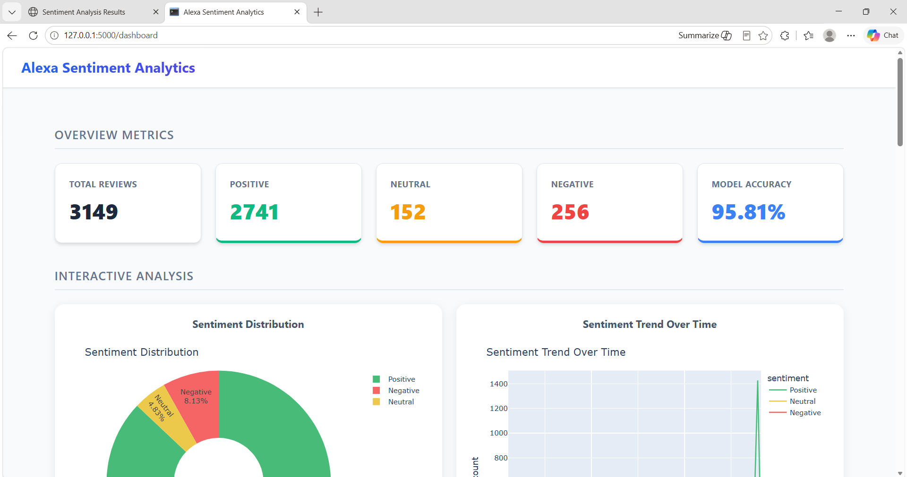
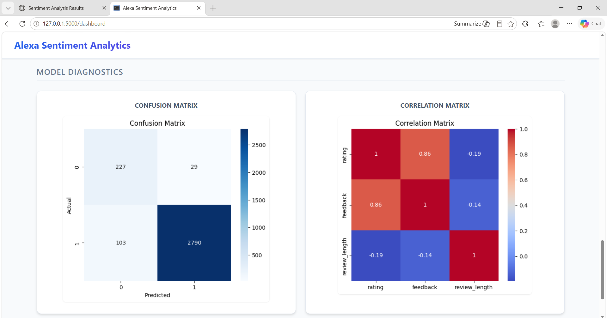


### Sentiment Distribution Pie Chart

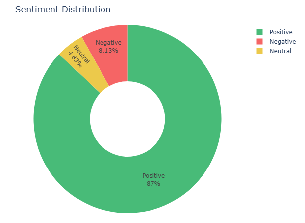

### Sentiment Trend Analysis

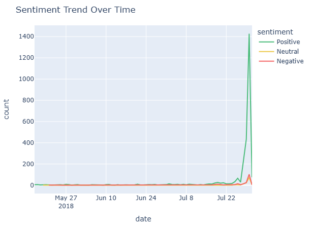


### Rating Distribution Histogram

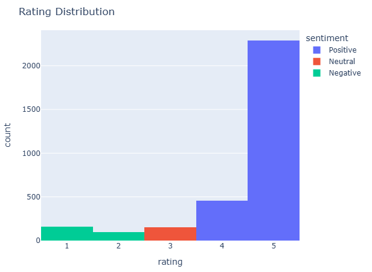


### Rating vs Review Length

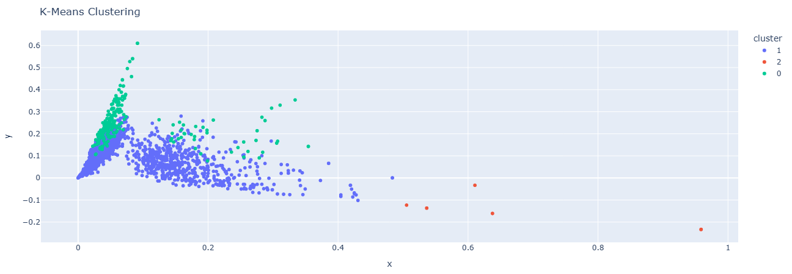


### KMeans Clustering

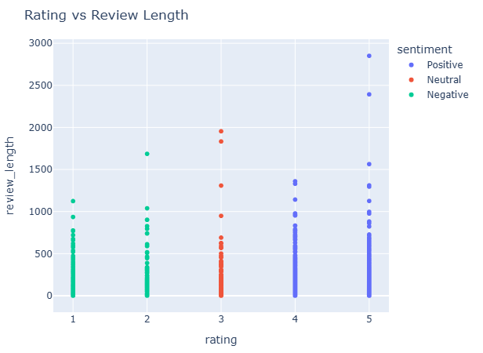


### Theme Analysis (Word Clouds)

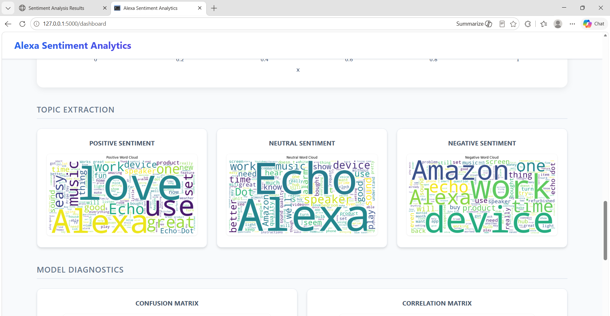


## 🧠 ML Workflow

1. **Data Ingestion**: Loading the Amazon Alexa reviews dataset into Pandas.
2. **Data Preprocessing**: Extensive NLP cleaning including stopword removal, lowercasing, punctuation removal, and tokenization.
3. **Feature Extraction**: Transforming cleaned text data into structured numerical vectors using **TF-IDF Vectorization**.
4. **Model Training**: Training a **Logistic Regression** classifier optimized for multi-class classification (Positive, Neutral, Negative).
5. **Evaluation**: Assessing the model via Accuracy, Precision, Recall, F1-Score, and a Confusion Matrix.
6. **Deployment**: Serializing the model (`.pkl`) and integrating it into a **Flask** web application for real-time inference.

## 📁 Project Structure

```bash id="s6gktj"
alexa_sentiment_app/
│
├── app.py
├── visualizations.py
├── train_model.py
├── amazon_alexa.tsv
├── robust_sentiment_model.pkl
├── tfidf_vectorizer.pkl
│
├── templates/
│   ├── index.html
│   ├── results.html
│   └── dashboard.html
│
├── static/
│   ├── style.css
│   └── visualizations/
│
├── screenshots/
│
├── README.md
├── requirements.txt
├── LICENSE
└── .gitignore
```

## 🚀 Installation Guide

1. **Clone the repository:**
   ```bash
   git clone https://github.com/yourusername/alexa_sentiment_app.git
   cd alexa_sentiment_app
   ```

2. **Create and activate a virtual environment (Recommended):**
   ```bash
   python -m venv venv
   source venv/bin/activate  # On Windows use: venv\Scripts\activate
   ```

3. **Install the required dependencies:**
   ```bash
   pip install -r requirements.txt
   ```

4. **Download NLTK Data:**
   ```bash
   python -c "import nltk; nltk.download('stopwords'); nltk.download('punkt'); nltk.download('wordnet')"
   ```

## 🏃 Run Instructions

1. **(Optional) Re-train the model and generate initial visualizations:**
   ```bash
   python train_model.py
   python visualizations.py
   ```

2. **Start the Flask backend server:**
   ```bash
   python app.py
   ```

3. **Access the Dashboard:**
   Open your preferred web browser and navigate to `http://127.0.0.1:5000/`.

## 📦 Dataset Details

* **Source**: Amazon Alexa Product Reviews Dataset (Kaggle).
* **Features**: Rating, Date, Verified Reviews, Feedback.
* **Target Variable**: Derived Sentiment (Positive, Neutral, Negative).

## 🎯 Model Accuracy

The Logistic Regression model, paired with TF-IDF Vectorization, achieves a robust accuracy of approximately **93%** on the validation set, demonstrating high reliability in classifying user sentiment effectively.

## 🔮 Future Improvements

* Implement advanced Deep Learning models (LSTM, BERT) for improved contextual and sequential understanding.
* Integrate live web scraping to fetch real-time Amazon reviews for dynamic dashboard updates.
* Add user authentication and role-based access for personalized dashboards.
* Containerize the application using Docker for streamlined cloud deployment (AWS/Heroku).

## 📄 License

This project is licensed under the MIT License - see the [LICENSE](LICENSE) file for details.

## ✍️ Author

**Vinay Esnapuram**
* GitHub: [@yourusername](https://github.com/yourusername)
* LinkedIn: [Vinay Esnapuram](https://linkedin.com/in/yourusername)
